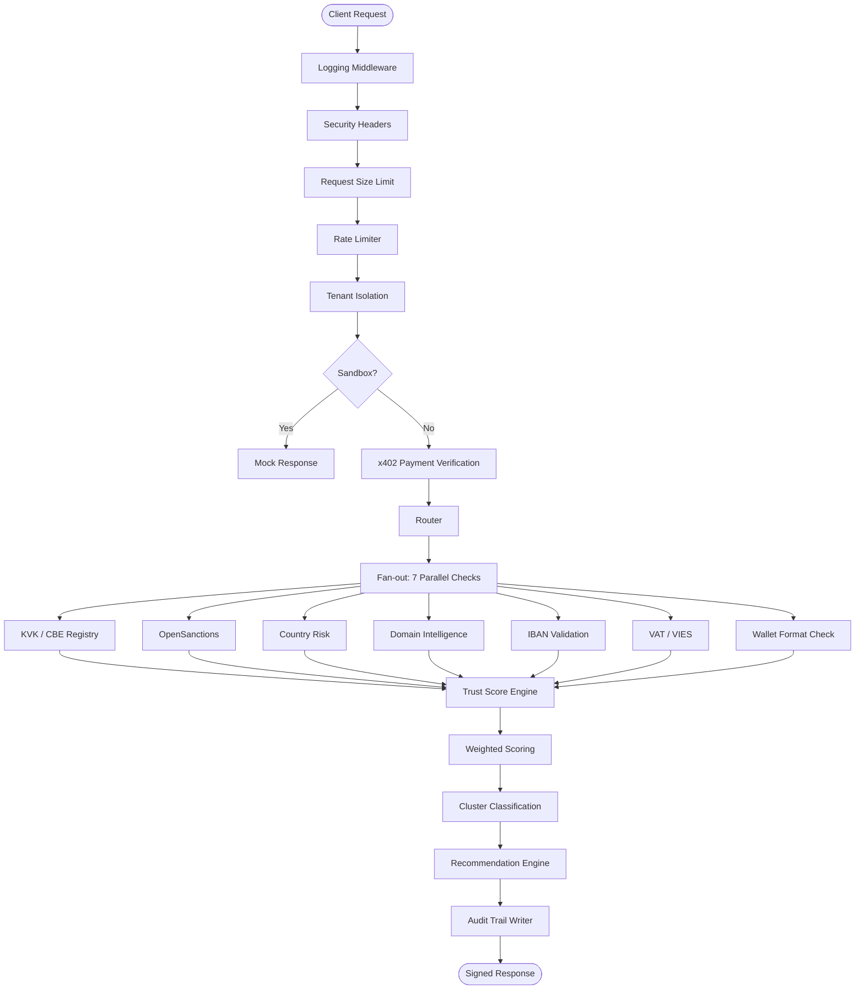
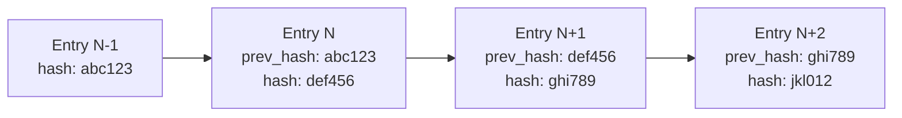

**Don't trust us. Verify us.**

That is the operating philosophy behind every architectural decision at LimitGuard. We are a trust infrastructure provider — and trust infrastructure must be independently verifiable. This document explains exactly how the system is built, what data it touches, where it lives, and how you can confirm every claim we make.

<Note>
LimitGuard publishes its own trust signals at `GET /v1/self-verify`: public, free, no key needed. Every signal links to evidence you can check yourself, starting with the Dutch business register (KVK) entry of the company that operates LimitGuard.
</Note>

---

## Zero-Access Trust Model

LimitGuard is built on a zero-access principle: we minimize what we store, we make what we do store auditable, and we give you the tools to verify us independently.

<CardGroup cols={3}>
  <Card title="Data Minimisation" icon="user-slash">
    Only the fields you submit are processed. Check records are kept for 365 days, the audit log stores one-way hashes of entity identifiers, and `GET /v1/data/retention` lists every retention period.
  </Card>
  <Card title="EU Data Residency" icon="shield-halved">
    Application data is stored in the EU. LimitGuard is operated by Ambulatio Consulting B.V. (trading as LimitGuard), a Dutch company registered with the KVK under 77272471.
  </Card>
  <Card title="Self-Verifying" icon="circle-check">
    LimitGuard verifies itself with its own API. The result is public at `GET /v1/self-verify`, and each signal carries a link to its evidence.
  </Card>
</CardGroup>

<CardGroup cols={3}>
  <Card title="Hash Chain Audit Trail" icon="link">
    Every verification event is recorded in a tamper-evident hash chain. No entry can be modified without breaking the chain.
  </Card>
  <Card title="Certificate Records" icon="certificate">
    Trust certificates are API records issued and verified via `/v1/certificate/*`, not written to any blockchain or contract. LimitGuard's only on-chain footprint is its own ERC-8004 agent identity (agent 95545 on Base).
  </Card>
  <Card title="Security Transparency" icon="eye">
    Responsible disclosure via RFC 9116. Our `/.well-known/security.txt` is public. The security mailbox is hosted on Proton Mail.
  </Card>
</CardGroup>

---

## Data Flow

A single `POST /v1/entity/check` request moves through the following stages. All 7 data sources are queried in **parallel**, not sequentially, which is why median response time is under 500ms.



<Note>
The middleware chain runs top-to-bottom on every request. Sandbox detection fires **before** payment verification — if you are in sandbox mode, x402 is never reached. See [Sandbox Mode](/sandbox) for details.
</Note>

---

## Middleware Security Stack

Every request passes through 8 middleware layers before reaching the router. Order is fixed and cannot be bypassed.

| Position | Middleware | Purpose |
|----------|-----------|---------|
| 1 | **Logging** | Structured request logging with correlation IDs |
| 2 | **Security Headers** | HSTS, CSP, X-Frame-Options, X-Content-Type-Options |
| 3 | **Request Size Limit** | Blocks oversized payloads before parsing |
| 4 | **Rate Limiter** | Per-tenant, per-IP sliding window limits |
| 5 | **Tenant Isolation** | API key validated; request scoped to tenant context |
| 6 | **Sandbox** | Detects sandbox mode; bypasses downstream if active |
| 7 | **x402 Payment** | Verifies EIP-3009 signature or checks API key tier |
| 8 | **Router** | Dispatches to endpoint handler |

```
Request → Logging → Security Headers → Request Size Limit → Rate Limit
        → Tenant Isolation → Sandbox → x402 Payment → Router
```

<Tip>
Security headers are set at the middleware layer, not the application layer. This ensures they are present on every response — including errors, health checks, and 402 responses — regardless of which handler processes the request.
</Tip>

---

## The 7 Data Sources

LimitGuard queries 7 independent data sources in parallel. No single source determines the outcome: the trust score is a weighted composite across all available signals.

<CardGroup cols={2}>
  <Card title="1. KVK / CBE Registry" icon="building">
    **Dutch Chamber of Commerce (KVK) and Belgian CBE business registry.**

    Verifies legal registration status, company age, registered address, SBI/NACE activity codes, and filing history. An active registration with multi-year history is a strong positive signal. Shell companies and recently dissolved entities are flagged.
  </Card>
  <Card title="2. OpenSanctions" icon="shield">
    **80+ global sanctions and watchlist sources.**

    Checks against OFAC (US), EU consolidated list, UN Security Council, UK OFSI, and dozens of national and regional lists. OpenSanctions is the industry-standard open-source sanctions dataset — updated daily.
  </Card>
  <Card title="3. Country Risk" icon="globe">
    **CPI (Corruption Perceptions Index) + FATF grey and blacklist.**

    Jurisdiction risk is evaluated using Transparency International's CPI score and the FATF (Financial Action Task Force) list status. High-risk jurisdictions — particularly FATF blacklisted or greylisted countries — reduce the trust score regardless of other signals.
  </Card>
  <Card title="4. Domain Intelligence" icon="link">
    **WHOIS registration age, DNS configuration, and SSL certificate analysis.**

    Domain age is a strong fraud signal: most fraudulent entities use recently registered domains. We also inspect DNS records for anomalies, check for DMARC/SPF/DKIM email authentication, and validate SSL certificate chain and expiry.
  </Card>
  <Card title="5. IBAN Validation" icon="credit-card">
    **Bank account structure and BIC/SWIFT verification.**

    Validates the structural integrity of provided IBANs, resolves the BIC, and checks the issuing institution against known risk lists. Mismatched country codes between the IBAN and the declared entity jurisdiction are flagged.
  </Card>
  <Card title="6. VAT / VIES" icon="file-invoice">
    **EU VAT number validation via the European Commission VIES system.**

    Confirms that the provided VAT number is active and registered to the declared entity name. VIES is the authoritative EU source for cross-border VAT verification — used by tax authorities across all 27 member states.
  </Card>
  <Card title="7. Wallet Format Check" icon="wallet">
    **Address-format validation for ETH/EVM, BTC, and SOL addresses.**

    The entity check only validates that a submitted wallet address is well-formed for its chain (regex match, no lookups). It does not screen against mixer, darknet, or sanctioned-wallet lists, and it is not factored into the trust score. For real wallet screening (OFAC SDN match, on-chain signals, and named risk rules), use the separate, free wallet screening tool (`verify_wallet` / `POST /v1/mcp/verify-wallet`).
  </Card>
</CardGroup>

### Source Availability by Request

Not every source is queried on every request. Source selection depends on which identifiers are provided and which tier (`cached` or `fresh`) is requested.

| Source | Required Field | Always Queried? |
|--------|---------------|-----------------|
| KVK Registry | `kvk_number` or NL `country` | No — NL/BE only |
| CBE Registry | `cbe_number` or BE `country` | No — NL/BE only |
| OpenSanctions | `entity_name` | Yes |
| Country Risk | `country` | Yes |
| Domain Intelligence | `domain` | When provided |
| IBAN Validation | `iban` | When provided |
| VAT / VIES | `vat_number` | When provided |
| Wallet Format Check | `wallet_address` | When provided |

<Note>
More identifiers = higher confidence. An entity check that includes a KVK number, domain, VAT number, and IBAN will produce a significantly more accurate score than one submitted with name and country only.
</Note>

---

## Trust Scoring Methodology

The trust score is not a black box. Every score comes with `top_factors` that explain exactly which signals drove the result, which source produced them, and how much weight they carried.

### Output Fields

```json
{
  "trust_score": 87,
  "trust_level": "high",
  "cluster": "established_eu_sme",
  "recommendation": "proceed",
  "confidence": 0.94,
  "top_factors": [
    {
      "source": "kvk",
      "signal": "Active registration, 8+ years",
      "impact": "positive",
      "weight": 0.35
    },
    {
      "source": "sanctions",
      "signal": "No match across 80+ lists",
      "impact": "positive",
      "weight": 0.25
    },
    {
      "source": "vat",
      "signal": "VIES verified EU VAT — name match",
      "impact": "positive",
      "weight": 0.20
    },
    {
      "source": "domain",
      "signal": "Domain age 6+ years, valid DMARC",
      "impact": "positive",
      "weight": 0.15
    }
  ]
}
```

### Score Bands

| Score Range | `trust_level` | `recommendation` | Typical Action |
|-------------|---------------|------------------|----------------|
| 80 – 100 | `high` | `proceed` | Automated approval |
| 60 – 79 | `medium` | `review` | Human review recommended |
| 40 – 59 | `low` | `enhanced_due_diligence` | Enhanced KYB before proceeding |
| 0 – 39 | `critical` | `block` | Do not transact |

### Entity Clusters

The `cluster` field classifies entities into behavioural archetypes based on signal patterns across all sources. Cluster assignment improves interpretability — a `trust_score` of 72 means different things for an `established_eu_sme` versus a `newly_registered_offshore`.

| Cluster | Description |
|---------|-------------|
| `established_eu_sme` | Active EU registration 3+ years, VAT verified, clean sanctions |
| `large_enterprise` | Registry-verified, high domain age, multiple positive signals |
| `newly_registered` | Registration under 12 months — not inherently suspicious, but reduced confidence |
| `unverified_jurisdiction` | Country risk flag or no registry match |
| `high_risk_indicators` | One or more active risk flags (sanctions proximity, FATF jurisdiction, mixer wallet) |
| `sanctioned_entity` | Direct sanctions match — automatic `block` recommendation |

### Confidence Score

The `confidence` field (0–1) reflects how much data was available to produce the score. An entity verified across 6 of 7 sources scores `0.96+`. An entity verified with name and country only may score `0.55`.

<Tip>
Build confidence thresholds into your integration policy. For example: require `confidence >= 0.80` before automated approval, regardless of the trust score itself.
</Tip>

---

## Infrastructure and Data Residency

### Where Your Data Lives

| Layer | Location | Provider |
|-------|----------|----------|
| API, audit log and cache (Redis) | Germany | Contabo GmbH (VPS) |
| Dashboard application | Germany (Falkenstein) | Hetzner Online GmbH |
| Database: dashboard accounts, workspaces and check records | Ireland (AWS eu-west-1) | Supabase |
| CDN and web application firewall | Global edge network | Cloudflare, Inc. |
| Operator | Breda, the Netherlands | Ambulatio Consulting B.V. (trading as LimitGuard), KVK 77272471 |

<Note>
Application data (API requests, check records, audit logs and dashboard accounts) is stored in the EU. Cloudflare, a US company, routes and filters traffic to LimitGuard under the EU-US Data Privacy Framework; the [privacy policy](https://limitguard.ai/privacy) describes its role.
</Note>

### GDPR Compliance

LimitGuard is GDPR-compliant by default — not through configuration.

<Steps>
  <Step title="Data minimization">
    Only the fields you submit are processed. We do not enrich requests with additional personal data beyond what is required for verification.
  </Step>
  <Step title="Limited retention">
    Each non-sandbox check is stored with its normalised identifiers (IBANs only as a keyed hash) for 365 days, then deleted. The audit log stores one-way hashes of entity identifiers, never the identifiers themselves. `GET /v1/data/retention` (any API key) lists every data category and its retention period.
  </Step>
  <Step title="Right to erasure (Art. 17)">
    GDPR Article 17 right to erasure is supported. Send `DELETE /v1/data/purge` with the `entity_name` (and optionally a `wallet_address`) to erase that entity's records held for your API key, including its check records. Matching audit entries are tombstoned rather than removed, so `GET /v1/audit/verify` can still check the chain.
  </Step>
  <Step title="EU data residency">
    Application data is stored in the EU (see the table above). Cloudflare routes traffic under the EU-US Data Privacy Framework.
  </Step>
  <Step title="Legal documents">
    The [privacy policy](https://limitguard.ai/privacy), [data processing agreement](https://limitguard.ai/dpa) and [terms of service](https://limitguard.ai/terms) are published on limitguard.ai. The API also serves them at `GET /v1/legal/privacy`, `/v1/legal/dpa` and `/v1/legal/terms`.
  </Step>
</Steps>

---

## Audit Trail and Hash Chain Integrity

Every verification event is recorded in a tamper-evident append-only log. Each entry includes a SHA-256 hash of the previous entry — forming a hash chain that makes retroactive modification detectable.

### How the Chain Works



If any historical entry is modified, its hash changes — which breaks every subsequent entry in the chain. The break is immediately detectable by any verifier replaying the chain from the genesis entry.

### Audit Entry Structure

```json
{
  "event_id": "7f3c9a1e-...",
  "timestamp": "2026-02-20T09:14:33.421Z",
  "entity_hash": "b94d27b9...",
  "trust_score": 87,
  "trust_level": "high",
  "cluster": "established_eu_sme",
  "recommendation": "proceed",
  "sources_checked": 5,
  "processing_time_ms": 412,
  "previous_hash": "3e4f2a1c...",
  "entry_hash": "9c1b8d0e...",
  "erased_at": "",
  "erasure_request_id": ""
}
```

<Note>
Audit entries contain **hashes of entity identifiers**, not the identifiers themselves. The entity name, KVK number, and other submitted fields are never stored in the audit log — only a one-way hash that allows correlation without reconstruction.
</Note>

### Querying the Audit Trail

Both endpoints are scoped to your own API key.

```bash
# Your audit entries for one entity (entity_id is the entity_hash), newest first
curl "https://api.limitguard.ai/v1/audit/query?entity_id=b94d27b9...&limit=100" \
  -H "X-API-Key: lg_live_xxxxxxxxxxxxxxxxxxxx"

# Check the hash chain
curl https://api.limitguard.ai/v1/audit/verify \
  -H "X-API-Key: lg_live_xxxxxxxxxxxxxxxxxxxx"
```

```json
{
  "chain_valid": true,
  "records_checked": 1824
}
```

`GET /v1/audit/query` also takes `from`, `to` and `offset`, and returns `{"entries": [...], "count", "limit", "offset"}` with each entry in the shape above.

---

## Self-Verification

LimitGuard verifies itself using its own API. This endpoint is public, free, and unauthenticated. It returns six published signals about the operator, each with an evidence link, and the score they add up to.

```bash
curl https://api.limitguard.ai/v1/self-verify
```

```json
{
  "entity_name": "Ambulatio Consulting BV (trading as LimitGuard)",
  "trust_score": 100,
  "trust_level": "HIGH",
  "verified_at": "2026-09-25T19:06:06Z",
  "signals": [
    {
      "signal_name": "Dutch EU Entity",
      "status": "verified",
      "verifiable": true,
      "evidence_url": "https://www.kvk.nl/zoeken/",
      "description": "Registered Dutch entity (KVK 77272471, Ambulatio Consulting BV)"
    },
    {
      "signal_name": "GDPR Compliance",
      "status": "verified",
      "verifiable": true,
      "evidence_url": "https://limitguard.ai/privacy",
      "description": "EU-based hosting, data minimization, right to erasure"
    },
    {
      "signal_name": "Open Methodology",
      "status": "verified",
      "verifiable": true,
      "evidence_url": "https://api.limitguard.ai/v1/methodology",
      "description": "Scoring algorithm and weights published publicly"
    },
    {
      "signal_name": "Multi-Source Consensus",
      "status": "verified",
      "verifiable": true,
      "evidence_url": "https://api.limitguard.ai/v1/methodology",
      "description": "Trust scores derived from multiple independent sources"
    },
    {
      "signal_name": "Audit Trail",
      "status": "verified",
      "verifiable": true,
      "evidence_url": "https://api.limitguard.ai/v1/audit/verify",
      "description": "Scored checks are recorded in a tamper-evident, hash-chained audit log; any API key can check the chain"
    },
    {
      "signal_name": "ERC-8004 Identity",
      "status": "verified",
      "verifiable": true,
      "evidence_url": "https://api.limitguard.ai/.well-known/agent-registration.json",
      "description": "Registered as agent 95545 on the ERC-8004 Identity Registry (eip155:8453:0x8004A169FB4a3325136EB29fA0ceB6D2e539a432)"
    }
  ],
  "scoring_methodology_url": "https://api.limitguard.ai/v1/methodology"
}
```

<Tip>
We recommend integrating `/v1/self-verify` into your vendor due diligence workflow. The response is computed on every request, not cached.
</Tip>

---

## Trust Certificates (API Records, Not On-Chain)

Trust certificates are records LimitGuard issues, stores, and verifies over its own REST API. They are **not** written to a blockchain, anchored to a contract, or backed by the ERC-8004 standard: nothing about certificate storage or verification touches a chain. The only on-chain element anywhere in LimitGuard is its own agent identity: agent `95545` on the [ERC-8004 Identity Registry](https://basescan.org/address/0x8004A169FB4a3325136EB29fA0ceB6D2e539a432) on Base, which is unrelated to certificate issuance.

### How Certificates Work

<Steps>
  <Step title="Certificate requested">
    A caller with an API key sends `POST /v1/certificate/issue` with an entity name, country, and the `trust_score` / `trust_level` to record.
  </Step>
  <Step title="Not derived automatically">
    The trust score on a certificate is supplied by the caller in the request; it is not computed or re-verified server-side from a completed `/v1/entity/check`. Issuance is being restricted to LimitGuard admins for this reason.
  </Step>
  <Step title="Stored as an API record">
    LimitGuard holds the certificate in its own store (`certificate_id`, entity name, country, trust score/level, `issued_at`, `expires_at`, and a SHA-256 `certificate_hash` of those fields). Certificates expire based on `valid_days` (default 365) and can be revoked by their owner.
  </Step>
  <Step title="Public verification">
    Anyone can verify a certificate via `GET /v1/certificate/{certificate_hash}` (public, no auth). There is no separate on-chain copy to cross-check it against; this API response is the record.
  </Step>
</Steps>

### Certificate Fields

| Field | Type | Description |
|-------|------|-------------|
| `certificate_id` | `string` | Unique certificate UUID |
| `entity_name` | `string` | Name of the certified entity |
| `trust_score` | `int` | Score recorded at issuance (0–100), as supplied in the issue request |
| `issued_at` / `expires_at` | `datetime` | Issuance timestamp and expiry (`valid_days` after issuance, default 365) |
| `certificate_hash` | `string` | SHA-256 hash of the certificate's content fields |
| `status` | `string` | `active` or `revoked` |

### Querying Certificates

```bash
# Issue (requires an API key; being restricted to LimitGuard admins)
POST /v1/certificate/issue

# Verify (public, no auth)
GET /v1/certificate/{certificate_hash}

# Revoke (requires an API key; tenant-scoped to the issuing key)
POST /v1/certificate/{certificate_hash}/revoke
```

<Note>
Certificates do expire: `verify_certificate` checks the current time against `expires_at` and marks the certificate invalid once it has passed, alongside `active`/`revoked` status. There is no smart contract to query directly: verification is entirely through the endpoint above, so it depends on LimitGuard's own uptime like any other endpoint.
</Note>

---

## Security Transparency

### RFC 9116 Security Contact

LimitGuard publishes a machine-readable security contact per RFC 9116:

```bash
curl https://api.limitguard.ai/.well-known/security.txt
```

```
Contact: mailto:security@limitguard.ai
Expires: 2027-09-25T19:07:15.000Z
Preferred-Languages: en, nl
Canonical: https://api.limitguard.ai/.well-known/security.txt
Canonical: https://limitguard.ai/.well-known/security.txt
Policy: https://limitguard.ai/security
```

`Expires` is always one year ahead of the request.

### Encrypted Communications

`security@limitguard.ai` is hosted on **Proton Mail** (Switzerland). Messages from other Proton Mail users are end-to-end encrypted; messages from other providers are encrypted at rest once received.

### Responsible Disclosure

We operate a responsible disclosure programme. Security researchers who identify vulnerabilities in good faith will receive acknowledgement, coordinated disclosure timelines, and credit. See [limitguard.ai/security](https://limitguard.ai/security) for the full programme terms.

---

## Summary: What We Claim vs. How You Verify It

| Claim | How to Verify |
|-------|--------------|
| EU data storage | [Privacy policy](https://limitguard.ai/privacy) and [DPA](https://limitguard.ai/dpa): providers, locations and purposes |
| Dutch operator | KVK register: Ambulatio Consulting B.V. (trading as LimitGuard), KVK 77272471 |
| Limited retention | `GET /v1/data/retention`: every data category and its retention period |
| GDPR Art. 17 erasure | `DELETE /v1/data/purge`: functional endpoint, not just a policy |
| Hash chain integrity | `GET /v1/audit/verify` and `GET /v1/audit/query`: check the chain and your own entries |
| Trust certificates | `GET /v1/certificate/{certificate_hash}`: public verification endpoint; the record lives in LimitGuard's API, not on a blockchain |
| Self-verifying | `GET /v1/self-verify` — our score, produced by our own API, public |
| Security contact | `GET /.well-known/security.txt` — RFC 9116 compliant |

<Note>
Every claim in this document is backed by a verifiable endpoint or public record. We built it this way intentionally — because a trust infrastructure provider that asks you to "just trust us" has missed the point entirely.
</Note>

---

## Further Reading

<CardGroup cols={2}>
  <Card title="Self-Verification Methodology" icon="chart-bar" href="https://api.limitguard.ai/v1/methodology">
    Machine-readable JSON: the signals, weights and evidence sources behind `GET /v1/self-verify`
  </Card>
  <Card title="x402 Protocol" icon="credit-card" href="/x402-protocol">
    How x402 payment verification works
  </Card>
  <Card title="Sandbox Mode" icon="flask" href="/sandbox">
    Test the full verification flow without touching real data sources
  </Card>
  <Card title="API Reference" icon="code" href="/api-reference/introduction">
    Full endpoint documentation including audit, certificate, and self-verify endpoints
  </Card>
</CardGroup>
